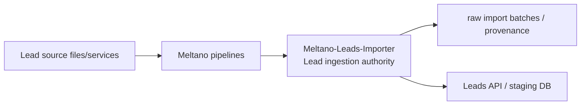
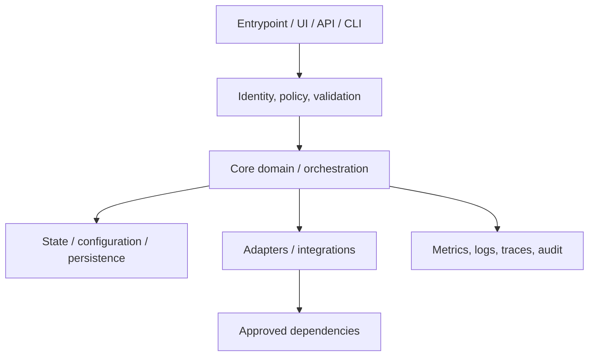
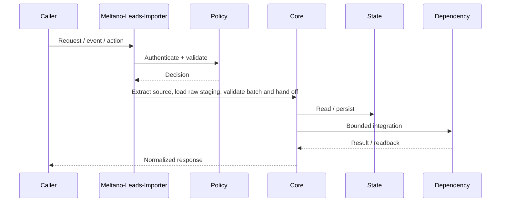
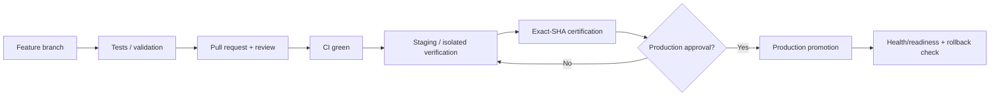
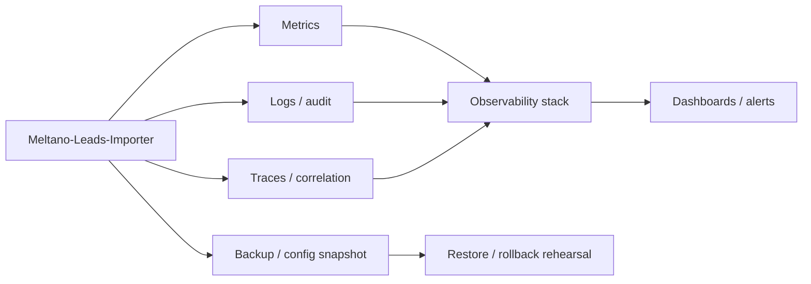

# Meltano-Leads-Importer — Architecture Charts

> Repository: `appolon1908/Meltano-Leads-Importer`  
> Baseline branch: `main`  
> Repository-local visual architecture. Keep these diagrams aligned with code, contracts, data ownership and deployment.

## 1. System context

## 2. Internal component architecture

## 3. Critical flow

## 4. Deployment and promotion

## 5. Observability and recovery

## Ownership notes
- **Role:** Lead ingestion authority
- **Primary boundary:** Meltano pipelines
- **State/config:** raw import batches / provenance
- **Dependencies/consumers:** Leads API / staging DB
- Cross-repository effects must use reviewed contracts; production effects remain separately gated.
